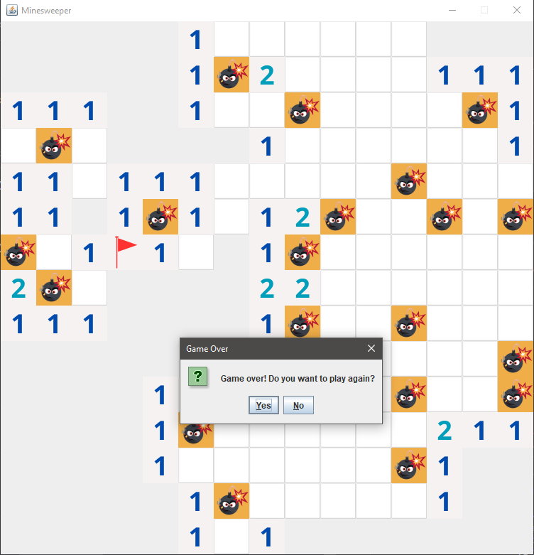

# Minesweeper Game

## Introduction
This Minesweeper game is a modern take on the classic grid-based puzzle game, implemented in Java with a graphical user interface. The project showcases an implementation that focuses on object-oriented design principles, employing patterns like MVC (Model-View-Controller) and Observer to create a scalable and maintainable codebase. This implementation aims to demonstrate clean coding practices, thoughtful architecture, and the use of Java Swing for building interactive GUI applications.

## Game Overview
Minesweeper is a single-player puzzle game. The game is played on a rectangular grid of tiles, some of which hide mines. The goal is to clear the board without detonating any mines. Clicking on a tile reveals what is underneath it: either a mine or a number showing how many mines are adjacent to that tile. Right-clicking on a tile marks it with a flag indicating a suspected mine. The challenge is to deduce where mines are located based on number clues.

## Key Features
* Game States: The game tracks and responds to different states, such as game over and win conditions.
* Graphical User Interface: A responsive and intuitive GUI built with Java Swing, BufferedImage, ImageIo, Graphics and other libraries.

# Architecture
## Primary Classes and Interfaces
- **GameBoard**: Represents the game logic and state, including the grid and positions of mines. It is responsible for game initialization and rules enforcement.
- **Tile**: Represents an individual cell in the game board, extends **AbstractTile** and implements **Clickable** Interface. It's capable of storing states such as revealed, flagged, and whether it contains a mine.

- **GameUI**: Handles all user interactions and rendering of the game board and game state. It updates the visual components based on user actions and game logic outputs.
- **BoardObserver** and **GameOverCallback** Interfaces: Facilitate communication between the game logic (GameBoard) and the user interface (GameUI). These observer interfaces allow the UI to update reactively to changes in the game state.
- **TileRenderer**: Manages the rendering of a Tile, abstracting the drawing logic from the tile's state management.

## Design Decisions
- **Observer Pattern**: This pattern was used to decouple the game logic from the UI components. It allows the GameBoard to notify GameUI of changes in the game state, promoting a reactive design where the UI updates automatically in response to game logic.
- **MVC Pattern Principles**: By separating concerns (model, view, controller), the application enhances maintainability and scalability. GameBoard acts as the model, GameUI as the view, and user interactions as the controller.
- **Exception Handling**: Robust handling of exceptional situations, such as illegal tile access and resource loading failures, ensures the game's reliability and stability.

## Usage
**Running the Game**
- To run the game, compile and execute the Main class. The game initialises with a default grid size, which can be adjusted via the settings menu within the application.

## Controls
- **Left Click**: Reveal the tile.
- **Right Click**: Flag the tile as containing a suspected mine.

# Future Enhancements
- Recursive Tile Reveal: When a user clicks on a tile with no adjacent mines, the game automatically opens neighboring tiles.
- Adjustable Difficulty Levels: Implementing preset difficulty levels (e.g., Beginner, Intermediate, Advanced) with corresponding grid sizes and mine counts.
- Leaderboard: Adding a scoring system and leaderboard to track and display high scores or fastest times.

## Conclusion
This Minesweeper project is not only a recreation of a classic game but also a demonstration of a steady and determined Java programming learning journey, techniques and design patterns. It serves as a robust example of how traditional software engineering principles can be applied on a classic game development.

